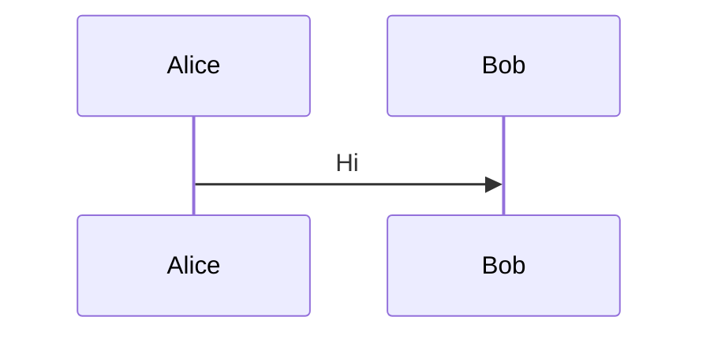
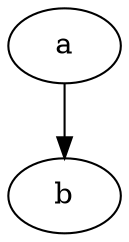
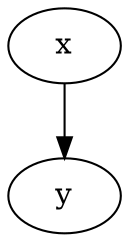

# Diagrams fixture

A mermaid flowchart:


A mermaid sequence diagram:



A DOT graph:



A graphviz-aliased DOT graph:



A regular Rust code block:

```rust
fn main() {}
```

A broken mermaid block:

```mermaid
not actually mermaid syntax %%%
```
